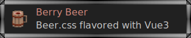

> 仍在开发中, **尚未准备好** 面向生产环境
> 
> Still under development, **not ready** for production use

自用 [Beer.css](https://www.beercss.com/) + [Vue 3](https://cn.vuejs.org/) 组件封装.

主要目的是简化部分 Beer.css 复合组件的使用 (比如 `<input>`).

类似 Beer.css, 此封装库采用了声明式设计.
Beer.css 中的各 CSS class 被转换为组件的 `props`.

Components wrapper lib of [Beer.css](https://www.beercss.com/) and [Vue 3](https://vuejs.org/) for personal use.

Main purpose is to simplify the usage of some Beer.css composite components (e.g. `<input>`).

Similar to Beer.css, this wrapper lib uses declarative design.
CSS classes in Beer.css are converted to `props` of components.

> 对于一个纯 CSS 库来说,  
> 进行此类封装并不一定是最好的选择,  
> 所以这个库更多是实验性质的.
>
> For a pure CSS lib,  
> this kind of wrapper may not be the best choice.  
> So this lib is more like an experiment.

```bash
npm i berry-beer-components
```

```html
<!-- Beer.css -->
<button class="primary small-round large-elevate">
    button text
</button>

<div class="field suffix label helper">
    <input type="text" placeholder="placeholder text">
    <i>search</i>
    <label>label text</label>
    <div class="helper">helper text</div>
</div>

<!-- Berry Beer -->
<bb-button primary small-round large-elevate>
    button text
</bb-button>

<bb-input type="text"
          placeholder="placeholder text"
          suffix="search"
          label="label text"
          helper="helper text" />
```

- [x] `<input>`
- [x] `<button>`
- [x] `<select>`
- [ ] slider
- [x] switch
- [x] radio
- [x] checkbox
- [ ] search
- [ ] progress
- [x] chip
- [ ] `<textarea>`
- [x] dialog
- [ ] menu
- [x] page
- [ ] snackbar
- [ ] stepper
- [ ] expansion
- [ ] layout(s)
- [x] color theme
